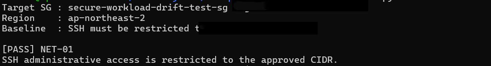
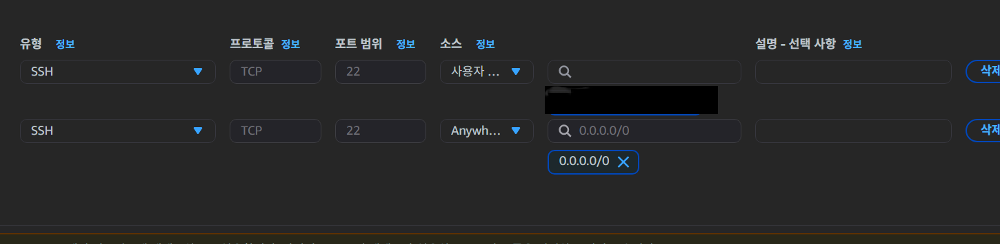
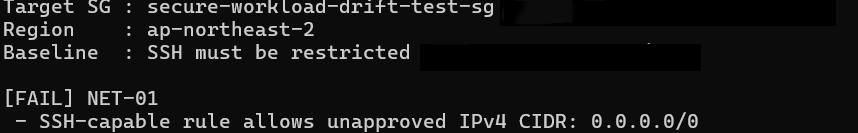
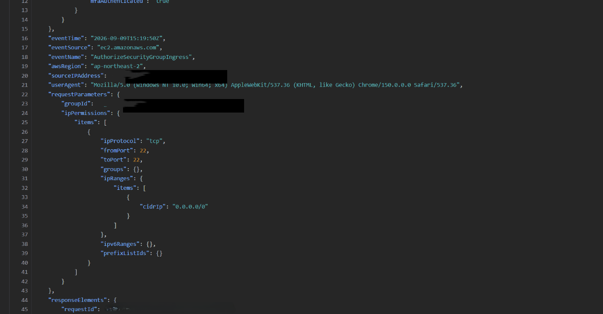
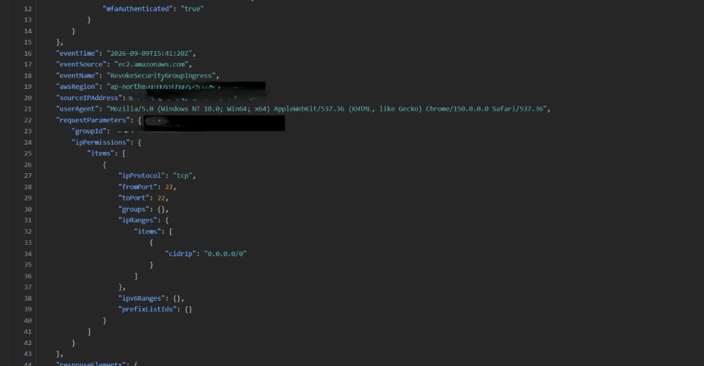
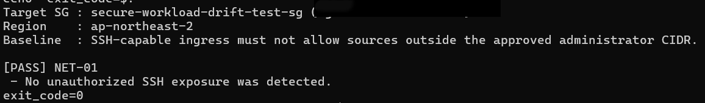

# Security Group Configuration Drift Detection & Remediation

## 1. Objective

This scenario validates whether administrative SSH access complies with the lab security baseline and demonstrates a complete security-control lifecycle:

**Baseline → Validation → Configuration Drift → Detection → Activity Analysis → Remediation → Re-validation**

The purpose is not to simulate an intrusion. The goal is to verify that an unsafe cloud configuration can be identified, traced to the corresponding AWS API activity, remediated, and re-validated.

---

## 2. Security Baseline

### NET-01 — Restrict administrative SSH access

> SSH administrative access must be restricted to the approved administrator CIDR and must not be exposed to the public Internet.

Normal state:

```text
TCP/22 → <APPROVED_ADMIN_CIDR>/32
```

Violation examples include:

```text
TCP/22 → 0.0.0.0/0
TCP/0-65535 → 0.0.0.0/0
All protocols → 0.0.0.0/0
```

The checker also treats an inability to evaluate the target as `UNKNOWN` rather than `PASS`.

---

## 3. Test Safety

A dedicated security group was created for this scenario:

```text
secure-workload-drift-test-sg
```

The test security group was **not attached to any EC2 instance or network interface**.

Therefore, the insecure rule could be reproduced without exposing the running Nginx workload. This separates:

- **Configuration risk:** an Internet-wide SSH rule exists.
- **Actual workload impact:** no server exposure occurred because the test SG was unattached.

---

## 4. Read-only Validation Design

The baseline checker runs on the lab EC2 instance and uses an EC2 IAM Role instead of static AWS access keys.

```text
EC2
  ↓
secure-workload-sg-audit-role
  ↓
secure-workload-sg-audit-policy
  ↓
ec2:DescribeSecurityGroups
  ↓
Python / Boto3 baseline checker
```

The custom IAM policy allows only:

```json
{
  "Effect": "Allow",
  "Action": "ec2:DescribeSecurityGroups",
  "Resource": "*"
}
```

The checker can inspect Security Groups but cannot add or remove rules.

Implementation: [`../../scripts/baseline_check.py`](../../scripts/baseline_check.py)

---

## 5. Normal-State Validation

The initial inbound rule allowed SSH only from the approved administrator CIDR.

The same baseline checker queried the target Security Group through Boto3 and returned:

```text
[PASS] NET-01
SSH administrative access is restricted to the approved CIDR.
```



This result establishes the known-good posture before the drift experiment.

---

## 6. Configuration Drift

An additional inbound rule was intentionally added to the **unattached test SG**:

```text
TCP/22 → 0.0.0.0/0
```



The checker code was not modified. Re-running the same validation produced:

```text
[FAIL] NET-01
SSH-capable rule allows unapproved IPv4 CIDR: 0.0.0.0/0
```



This demonstrates a posture change from `PASS` to `FAIL` based only on the live AWS configuration.

---

## 7. CloudTrail Activity Analysis

The baseline checker answers:

> **Is the current configuration compliant?**

CloudTrail answers a different question:

> **Who changed the configuration, when, and through which API?**

After the drift was introduced, CloudTrail recorded the management event:

```text
AuthorizeSecurityGroupIngress
```

The relevant request parameters showed:

```text
Protocol : TCP
FromPort : 22
ToPort   : 22
CIDR     : 0.0.0.0/0
```



### Activity interpretation

| Field | Observation |
|---|---|
| `eventSource` | `ec2.amazonaws.com` |
| `eventName` | `AuthorizeSecurityGroupIngress` |
| `awsRegion` | `ap-northeast-2` |
| `readOnly` | `false` |
| `requestParameters` | TCP/22 and `0.0.0.0/0` were requested |
| Event category | Management event |

The event confirmed that the `FAIL` state was caused by an explicit Security Group ingress modification.

The experiment does **not** classify this configuration change as an intrusion. A policy violation and a confirmed compromise are different conclusions and require different evidence.

---

## 8. Remediation

The Internet-wide SSH rule was removed while the approved administrator CIDR rule was retained.

CloudTrail recorded the corresponding API activity:

```text
RevokeSecurityGroupIngress
```

The event showed removal of:

```text
TCP/22 → 0.0.0.0/0
```



---

## 9. Re-validation

After remediation, the **same checker was executed again without changing the validation logic**.

Result:

```text
[PASS] NET-01
SSH administrative access is restricted to the approved CIDR.
```



The final state returned to the defined security baseline.

---

## 10. Result

The scenario completed the full control cycle:

```text
Known-good posture
      ↓
PASS
      ↓
Intentional configuration drift
      ↓
FAIL
      ↓
CloudTrail activity analysis
      ↓
AuthorizeSecurityGroupIngress
      ↓
Risk assessment
      ↓
RevokeSecurityGroupIngress
      ↓
Remediation
      ↓
PASS
```

### What was validated

- A security requirement was translated into a machine-checkable rule.
- Boto3 inspected the live AWS Security Group configuration.
- Validation used a least-privilege EC2 IAM Role instead of static access keys.
- The checker distinguished `PASS`, `FAIL`, and `UNKNOWN`.
- CloudTrail identified the API activity responsible for the configuration change.
- The insecure configuration was removed and re-validated.
- The experiment reproduced configuration risk without exposing the live workload.

---

## 11. Limitations and Future Improvements

This is a single-account lab and does not reproduce a production multi-account or hybrid-cloud environment.

Current limitations include:

- The scenario validates a defined lab baseline; it does not claim CIS or ISO 27001 compliance.
- Manual console changes were used to create and remediate the drift.
- The test focuses on Security Group posture rather than continuous enterprise-wide posture management.
- Lab administrative changes were performed through the AWS console; routine production administration should use appropriately scoped IAM identities rather than the AWS account root user.

Possible extensions:

- EventBridge-based detection for selected high-risk configuration changes
- IAM privilege-change detection
- Centralized multi-account logging
- AWS Config / Security Hub or CNAPP-based posture management
- Infrastructure as Code and policy validation before deployment
